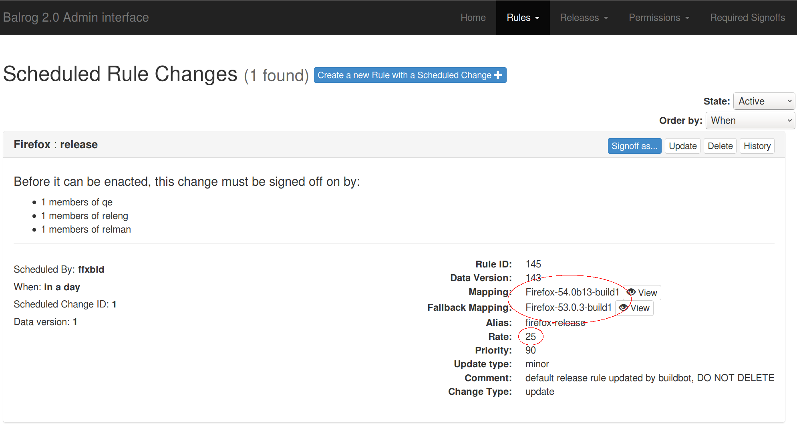
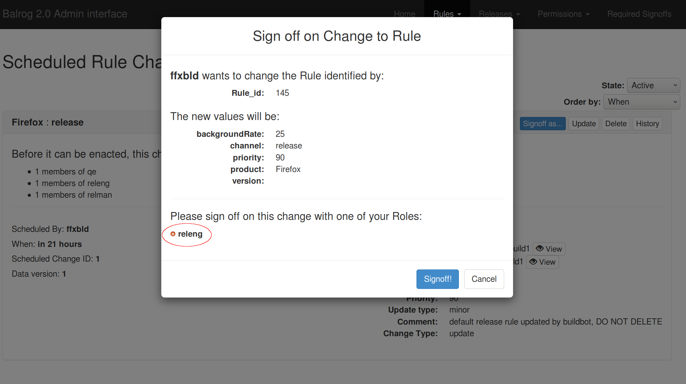
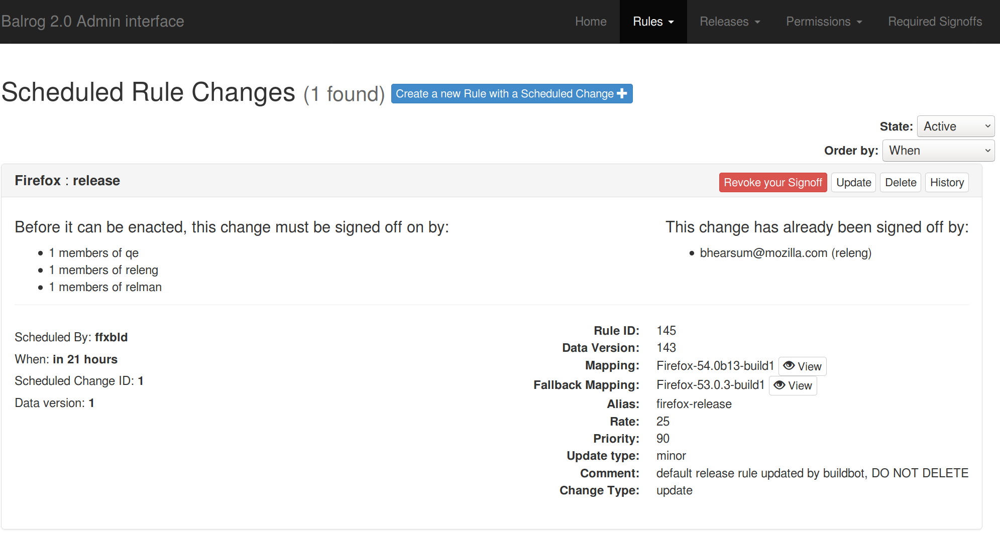
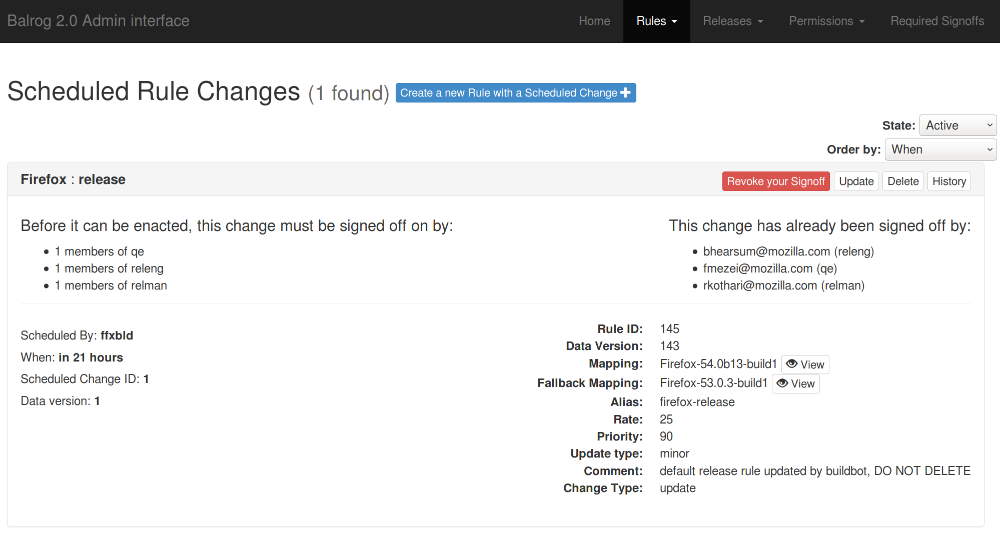

Balrog and Scheduled Changes
============================

Balrog can let you schedule changes in advance through its `Scheduled
Changes UI <https://aus4-admin.mozilla.org/rules/scheduled_changes>`__

Responsibilities
----------------

RelEng
~~~~~~

RelEng is responsible for reviewing the scheduled change to ensure that
the mechanics are correct. Most notably, the mapping, fallbackMapping,
and backgroundRate need to be verified.

RelMan
~~~~~~

RelMan is responsible for reviewing the scheduled change to ensure that
the shipping time is correct and to authorize that the release may be
shipped. If circumstances change (eg, we discover a bug we’re not
willing to ship) after they sign off, they must revoke their signoff in
Balrog.

Example
-------

After the Scheduled Change has been created, the Balrog UI will look
something like: |scheduled change without signoffs|

When RelEng reviews it, they will look at the Mapping, Fallback Mapping,
and Background Rate (circled above). If everything looks good, they will
click on the “Signoff as…” button and be presented with a dialog like:
|signoff modal dialog|

After they make their Signoff, the primary UI will reflect that:
|scheduled change with one signoff|

RelMan and QE will go through a similar process. Once they make their
Signoffs the primary UI will reflect that as well: |scheduled change
with two signoffs|

Now that the Signoff requirements have been met, the Scheduled Change
will be enacted at the prescribed time.

Watersheds
----------

If you need to update watersheds in balrog, there are also in-tree
changes for
`update-verify <https://searchfox.org/mozilla-central/source/taskcluster/ci/release-update-verify-config/kind.yml#57>`__
and it is worth searching for relevant entries in other places as
update-verify is refactored in 2020.

