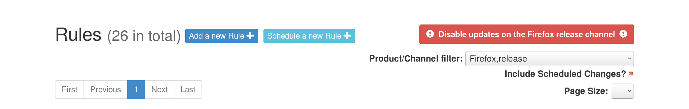

Change Update to Last Known Good
================================

Sometimes bad builds have been shipped and releaseduty must stop users
from updating to these builds. Here’s the suggested process:

1. Click on the big red button at the top right corner of the page:
   |scheduled change without signoffs| This will turn off all updates on
   this channel. This means any user with any build will be told there
   is no new update.
2. Figure out what is the ID of the last good build.
3. Schedule a rule change to that build. Let it be enacted (this may
   require signoffs from several teams).
4. Turn updates back on. From now on, users will update to the most
   recent good build.

Once a new build contains the fix
~~~~~~~~~~~~~~~~~~~~~~~~~~~~~~~~~

1. Schedule a rule change to:

-  ``*-latest`` on mozilla-central
-  the new build on devedition and mozilla-{beta,release}.

