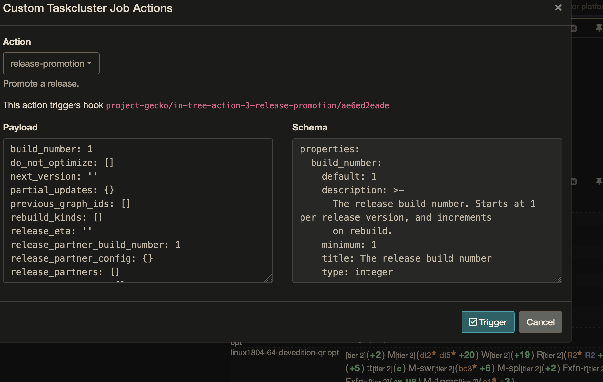
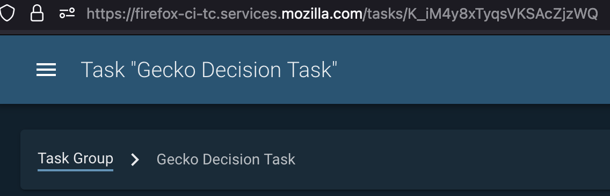
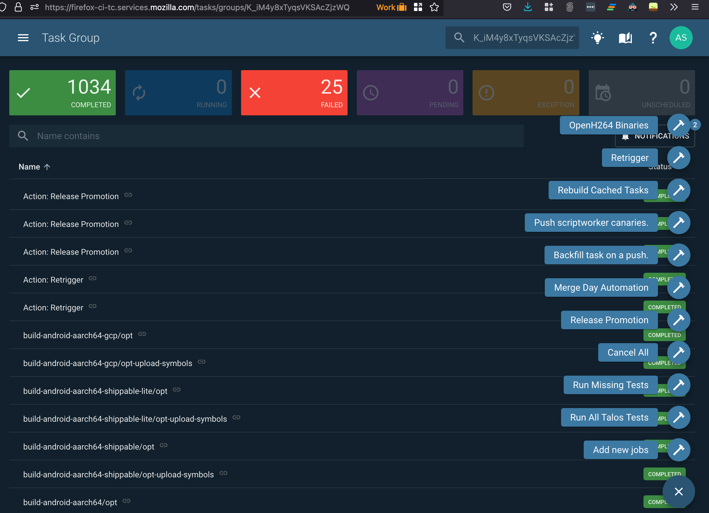
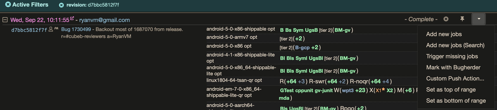

Testing and Customizing Release Promotion actions
=================================================

Actions in Taskgraph allow for adding, cancelling,
retriggering/rerunning tasks in/to the graph. The action docs are
currently
`here <https://firefox-source-docs.mozilla.org/taskcluster/actions.html?highlight=action>`__.

We can test any available action with
``[./mach] taskgraph test-action-callback``, which takes input (schemas
are defined per action), parameters, and taskId/taskGroupId commandline
options. You can run ``[./mach] taskgraph test-action-callback --help``
for more information.

(To find the schema, either go to the action itself, e.g. `gecko release promotion aciton schema <https://hg.mozilla.org/mozilla-central/file/d51a3f4602303979556ca1962d0fb271304e86fc/taskcluster/gecko_taskgraph/actions/release_promotion.py#l86>`__, or find the schema on the right hand side of the UI when :ref:`using-the-input`:

   Treeherder UI Action Input Schema

A successful ``[./mach] taskgraph test-action-callback`` run will create
an ``artifacts`` directory in the current working directory (or
``cwd``), which is the base of the repo. This ``artifacts`` directory
will contain the same artifacts that the action task would have created,
had it run in automation. This will generally include information about
tasks it would have scheduled, cancelled, reran or retriggered.

(We use ``./mach taskgraph test-action-callback`` in Gecko, and
``taskgraph test-action-callback`` in standalone taskgraph projects. The
square brackets around ``[./mach]`` indicate that we may or may not need
to include it in the command, depending on which project we’re testing.)

As of this writing (2021.10.06) Gecko actions are all defined in the
`actions
directory <https://searchfox.org/mozilla-central/source/taskcluster/gecko_taskgraph/actions>`__
in-Gecko-tree. Standalone taskgraph actions are either defined `in
taskgraph <https://github.com/taskcluster/taskgraph/tree/main/src/taskgraph/actions>`__
or in each repo (e.g. `Fenix
relpro <https://github.com/mozilla-mobile/fenix/blob/main/taskcluster/fenix_taskgraph/release_promotion.py>`__)

``taskGroupId``\ s
------------------

A decision task with taskId ``decision_task_id`` will, by convention,
have the same taskGroupId, ``decision_task_id``; if you click the
``Task Group`` link at the top left, you’ll find the task group that the
decision task has created.

   Task Group link

An action with a taskId ``action_task_id`` will, also by convention,
have a taskGroupId of the decision task, ``decision_task_id``. And
standard actions, like ``add-new-jobs``, will add additional tasks to
the same ``decision_task_id`` task group. The ``Task Group`` link will
take you to the decision task’s task group.

However, Release Promotion calls the
`taskgraph_decision <https://searchfox.org/mozilla-central/rev/a9ef6ad97d2d5f96d5ed51eda38f1a02700ccff7/taskcluster/gecko_taskgraph/actions/release_promotion.py#408>`__
function, which means for a given relpro task with taskId
``relpro_task_id``,

-  the release promotion task itself will have taskId ``relpro_task_id``
   but the taskGroupId of ``decision_task_id``, so the ``Task Group``
   link will take you to the *decision task’s* task group, and
-  the release promotion task will schedule a task group with the
   taskGroupId ``relpro_task_id``. If you are looking at the relpro task
   at
   ``https://firefox-ci-tc.services.mozilla.com/tasks/relpro_task_id``,
   you can replace the ``tasks`` in the url with ``tasks/groups`` to
   view the release promotion task group at
   ``https://firefox-ci-tc.services.mozilla.com/tasks/groups/relpro_task_id``.

Testing Release Promotion actions
---------------------------------

The Release Promotion action exists in multiple repositories (`Gecko,
for
example <https://searchfox.org/mozilla-central/source/taskcluster/gecko_taskgraph/actions/release_promotion.py>`__,
or
`Fenix <https://github.com/mozilla-mobile/fenix/blob/main/taskcluster/fenix_taskgraph/release_promotion.py>`__),
and tends to be customized for each product. Each follows similar
patterns, however. For instance, each follows the `☃
model <https://docs.google.com/presentation/d/1xCQZfLzCto0faO2AHXIsL-Xr-SsL2NnAVqSGbWGEcrg/edit?usp=sharing>`__.
Each consists of various ``flavors``, which tend to involve a ``phase``
(e.g. ``build``, ``promote``, ``push``, and ``ship`` for Gecko
releases), sometimes a ``product`` (``devedition`` vs ``firefox``), and
sometimes a variant, e.g. ``promote_firefox_rc`` or ``push_devedition``.

These are defined in
`taskcluster/ci/config.yml <https://searchfox.org/mozilla-central/rev/a9ef6ad97d2d5f96d5ed51eda38f1a02700ccff7/taskcluster/ci/config.yml#210>`__.

Replicating an existing release graph locally
~~~~~~~~~~~~~~~~~~~~~~~~~~~~~~~~~~~~~~~~~~~~~

To run ``[./mach] taskgraph test-action-callback``, we need a
``taskId``, a ``taskGroupId``, a parameters.yml, and an input.yml.

To replicate the input of a previously scheduled task, check the :download:`task
definition <relpro/promote_firefox_NpcI7tFfSDmYVyPNzkYMKw/task.json>`.
We embed it in ``task.payload.env.ACTION_INPUT``, and in a more useable
format in ``task.extra.action.context.input``.

(There is a :download:`helper
script <relpro/helpers/yaml_input_from_task_json.py>` that will open a
``task.json`` in the current directory, and print the input in yaml
format to STDOUT. With that, the input looks like
:download:`this <relpro/promote_firefox_NpcI7tFfSDmYVyPNzkYMKw/input.yml>`.)

For the ``taskId`` and ``taskGroupId``, use the ``taskId`` of the task you're
replicating, e.g. ``NpcI7tFfSDmYVyPNzkYMKw`` for the above ``promote_firefox`` task.

For the parameters, you want the decision task's ``parameters.yml``, though
the task-you're-replicating's ``parameters.yml`` will work as well. Essentially,
we'll be reading parameters from this file, and replacing values in it based
on the input.

In theory this is all you'll need, but some projects (e.g. Gecko), we'll block
on a taskcluster-proxy fetch of a github token from taskcluster-secrets to read
some private Github repository information, or the like. There are three possible
ways around that.

Let's get into an example promotion test.

Example promotion test
~~~~~~~~~~~~~~~~~~~~~~

Let's say we want to replicate :download:`promote_firefox 92.0.1 task
NpcI7tFfSDmYVyPNzkYMKw <relpro/promote_firefox_NpcI7tFfSDmYVyPNzkYMKw/task.json>`.

The ``GECKO_HEAD_REV``, various indexes, ``metadata.source``, etc. all point at
`revision d7bbc5812f7f36a9378165fffd7a058ddb0118ec <https://hg.mozilla.org/releases/mozilla-release/rev/d7bbc5812f7f36a9378165fffd7a058ddb0118ec>`__. We don't **have** to use
that revision; in fact, we may explicitly choose to use a different revision if
we're trying to fix something that's busted in the release graph (see :ref:`advanced-relpro-usage` below). In fact, because we renamed `taskgraph to gecko_taskgraph <https://bugzilla.mozilla.org/show_bug.cgi?id=1732723>`__ and ``test-action-callback`` was busted on central for that and other reasons, let's use the revision where ``test-action-callback`` was fixed, ``761973acc29f07810eb24b1a87347b4281d4aab5``: ::

    # in mozilla-unified
    hg up -r 761973acc29f07810eb24b1a87347b4281d4aab5

We already downloaded the :download:`task.json <relpro/promote_firefox_NpcI7tFfSDmYVyPNzkYMKw/task.json>`
either from this repo, or from
`taskcluster <https://firefox-ci-tc.services.mozilla.com/tasks/NpcI7tFfSDmYVyPNzkYMKw>`__
and converted it to :download:`input.yaml <relpro/promote_firefox_NpcI7tFfSDmYVyPNzkYMKw/input.yml>`.
We can also grab the decision task parameters.yml from
:download:`here <relpro/decision_K_iM4y8xTyqsVKSAcZjzWQ/parameters.yml>` or from the
`task <https://firefox-ci-tc.services.mozilla.com/tasks/K_iM4y8xTyqsVKSAcZjzWQ#artifacts>`__.

So if we downloaded the ``parameters.yml`` and ``input.yml`` into ``mozilla-unified`` our command would be: ::

    ./mach taskgraph test-action-callback --task-id NpcI7tFfSDmYVyPNzkYMKw \
    --task-group-id NpcI7tFfSDmYVyPNzkYMKw --input input.yml \
    --parameters parameters.yml release-promotion

At which point we get the following error: ::

    <snip>
    requests.exceptions.ConnectionError: HTTPConnectionPool(host='taskcluster', port=80):
    Max retries exceeded with url: /secrets/v1/secret/project/releng/gecko/build/level-3/partner-github-api
    (Caused by NewConnectionError('<urllib3.connection.HTTPConnection object at 0x121e5cda0>:
    Failed to establish a new connection: [Errno 8] nodename nor servname provided, or not known',))
    <snip>
    RuntimeError: Could not get Github API token to lookup partner data

Why is that? Because `here <https://hg.mozilla.org/mozilla-central/file/798c43651cb145ef813aa9ece37b6d965afc315f/taskcluster/gecko_taskgraph/util/partners.py#l163>`__ we're hardcoding a taskcluster secrets API call through the taskcluster proxy (``http://taskcluster:80``), and we don't have taskcluster-proxy running locally. (In fact, we're not even looking for ``os.environ.get("TASKCLUSTER_PROXY_URL", "http://taskcluster")``; we're `hardcoding the url root <https://hg.mozilla.org/mozilla-central/file/798c43651cb145ef813aa9ece37b6d965afc315f/taskcluster/gecko_taskgraph/util/partners.py#l138>`__.)

We do allow for setting ``os.environ.get("GITHUB_API_TOKEN")`` to skip this call, though. This token will need read access to the `mozilla-partners github private repos <https://github.com/mozilla-partners/>`__. One way is to go to `the level-3 secret <https://firefox-ci-tc.services.mozilla.com/secrets/project%2Freleng%2Fgecko%2Fbuild%2Flevel-3%2Fpartner-github-api>`__, copy it, export it as ``GITHUB_API_TOKEN`` in your shell (please don't leak this secret anywhere public), and re-run the above ``./mach taskgraph test-action-callback`` command.

Now we get this error: ::

    Traceback (most recent call last):
      File "/Users/asasaki/src/gecko/mozilla-unified/taskcluster/gecko_taskgraph/main.py", line 712, in test_action_callback
        test=True,
      File "/Users/asasaki/src/gecko/mozilla-unified/taskcluster/gecko_taskgraph/actions/registry.py", line 351, in trigger_action_callback
        cb(Parameters(**parameters), graph_config, input, task_group_id, task_id)
      File "/Users/asasaki/src/gecko/mozilla-unified/taskcluster/gecko_taskgraph/actions/release_promotion.py", line 408, in release_promotion_action
        taskgraph_decision({"root": graph_config.root_dir}, parameters=parameters)
      File "/Users/asasaki/src/gecko/mozilla-unified/taskcluster/gecko_taskgraph/decision.py", line 200, in taskgraph_decision
        decision_task_id = os.environ["TASK_ID"]
      File "/Users/asasaki/.pyenv/versions/3.6.10/lib/python3.6/os.py", line 669, in __getitem__
        raise KeyError(key) from None
    KeyError: 'TASK_ID'

Progress is a new error message :) This is from `this hardcode <https://hg.mozilla.org/mozilla-central/file/798c43651cb145ef813aa9ece37b6d965afc315f/taskcluster/gecko_taskgraph/decision.py#l200>`__ in ``taskgraph_decision``. Let's ``export TASK_ID=NpcI7tFfSDmYVyPNzkYMKw`` and rerun.

This time, we finish. After five plus minutes of output about "Generating tasks" and the like, we output the various task definitions to ``STDOUT``. Once that finishes, inspect the disk: we've created a ``docker-contexts`` directory and an ``artifacts`` directory. The ``parameters.yml``, ``label-to-taskid.json``, ``task-graph.json``, etc. artifacts show how we would have created the release graph, given these parameters, input, and code revision. We can diff these against the actual run relpro action task's artifacts if we want to see how we've changed things.

.. _advanced-relpro-usage:

Advanced relpro usage
~~~~~~~~~~~~~~~~~~~~~

``rebuild_kinds`` and ``do_not_optimize``
^^^^^^^^^^^^^^^^^^^^^^^^^^^^^^^^^^^^^^^^^

These two options allow for force-rebuilding certain tasks.

``rebuild_kinds`` refers to a task `kind <https://firefox-source-docs.mozilla.org/taskcluster/kinds.html?highlight=kind>`__ that we want to make sure we rebuild. We use this in the `promote_firefox_partner_repack <https://hg.mozilla.org/mozilla-central/file/32a3cf57dd4396e123ebbba2f894e540528d0781/taskcluster/ci/config.yml#l220>`__ release promotion flavor; by listing the various ``release-partner-repack*`` kinds as ``rebuild_kinds``, we can:

- use the exact same input for a given ``promote`` graph, adding the previous ``promote`` graph to the ``previous_graph_ids`` so we optimize away all the tasks in our new graph with the ``existing_tasks`` in the previous promote graph,
- except we add the ``rebuild_kinds``, which means we end up just rebuilding the tasks with those kinds.

The same is true for ``do_not_optimize``, except that refers to labels of tasks that we want to explicitly rerun, not task kinds.

Using multiple revisions
^^^^^^^^^^^^^^^^^^^^^^^^

As mentioned above, we can use a separate revision to create our new relpro graph.
You may want to do this if, for instance, you're fixing a bug in the graph.

We essentially:

- grab the parameters from the on-push decision task, and modify them in the action,
- grab the ``label_to_taskid.json`` files from each of the previous ``previous_graph_ids``, and apply them in order (last takes precedence. So if we have 3 ``previous_graph_ids``, and graphs 1 and 2 both contain a ``linux64-foo/opt`` task, we'll take the ``taskId`` of ``linux64-foo/opt`` from graph 2. This means we'll use it as a dependency, and potentially download and use artifacts from it, in our generated graph).

In this way, if our ``previous_graph_ids`` is then:

- The new revision's on-push decision ``taskId``, then
- the original revision's on-push decision ``taskId``, then
- any other ``previous_graph_ids`` (e.g. promote, push), in order,

then for any on-push tasks, we'll take the ``taskId``'s from the original ``on-push`` graph, unless the new revision added new task labels.

.. _using-the-input:

Using the tested input to craft a custom release graph
^^^^^^^^^^^^^^^^^^^^^^^^^^^^^^^^^^^^^^^^^^^^^^^^^^^^^^

You have the input you want to use, and the revision you want to run it against.
Now how do you trigger it? Two ways.

First, we can use the Taskcluster UI.

First, we need to find the decision task. You'll need to know the trust domain and what repo and revision we used; then you can find the decision task at a url like `<https://firefox-ci-tc.services.mozilla.com/tasks/index/gecko.v2.mozilla-release.revision.08b69dc588fbdd88334ebcb6fa303eec95176cd6.taskgraph/decision>`__.

Is that there? Great! Click on ``view task`` to find the Decision task, and ``Task group`` at the top left to go to the task group view.

   Task Group link

Once there, make sure you're logged in (top right), then click the three dots in the lower right. A menu like the below will show up:

   Taskcluster UI Release Promotion action

Then you fill in your input in the left hand box and click on ``Release Promotion`` in the lower right. Boom! Click on the ``taskId`` that pops up to follow along.

Alternately, you can use Treeherder. First, find your repo and commit. Make sure you're logged in in the top right. At the top right of your commit, you'll find a down arrow; click that, and choose ``Custom Push Action``.

   Treeherder UI Custom Push action

Choose ``release-promotion`` from the dropdown, paste in your input in the left hand column, and ``Trigger``. Click on the ``taskId`` that pops up to follow along.
