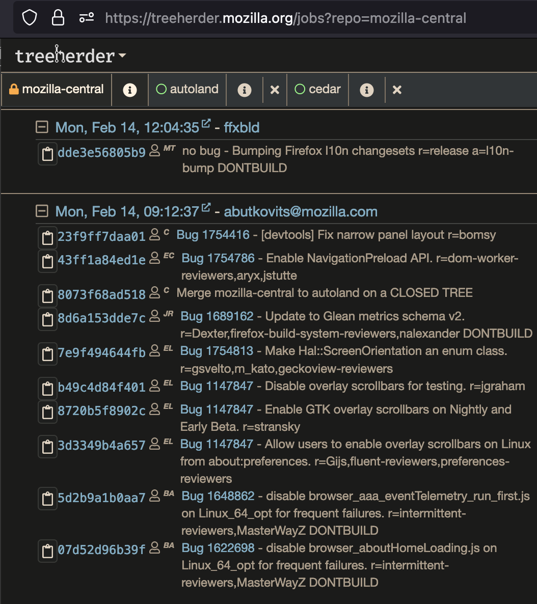
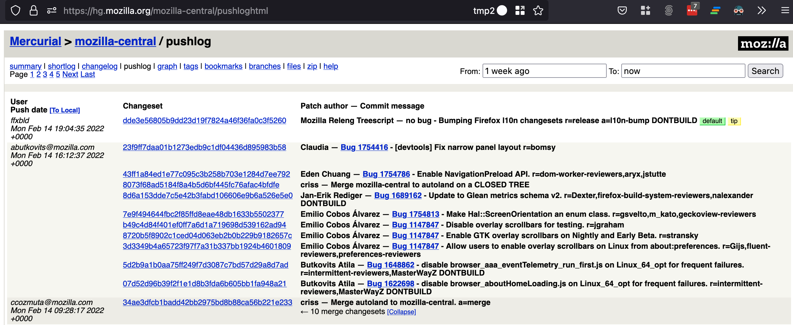

Taskcluster Staging
===================

Mozilla has three Taskcluster clusters: firefoxci, staging, and
community. Release Engineering only deals with the first two; any
Releng-supported tasks need to run in the firefoxci cluster.

Setup
-----

1. clone
   `ci-configuration <https://hg.mozilla.org/ci/ci-configuration/>`__
   and make sure it’s up to date

   .. code:: bash

      # First time clone; if so, we can skip the other hg commands
      hg clone https://hg.mozilla.org/ci/ci-configuration/

      # Make sure we don't have local uncommitted changes
      hg status

      # Make sure we're not on a local committed change
      hg checkout -r 'last(public())'

      # Get latest commit
      hg pull -u

      # Compare revision against latest revision in https://hg.mozilla.org/ci/ci-configuration/
      hg log -r .

2. Set up a python virtualenv, install ci-admin and fxci

   .. code:: bash

      # Using pyenv and python >=3.7
      PYTHON_VERSION=3.8.0
      pyenv virtualenv $PYTHON_VERSION cienv
      pyenv activate cienv

      # Install ci-admin and fxci into the virtualenv;
      # these will follow the checked-out revision in the clone
      python setup.py develop

Log into TC Staging and run ci-admin
------------------------------------

.. code:: bash

   # Activate above virtualenv
   pyenv activate cienv

   # Set root url
   export TASKCLUSTER_ROOT_URL=https://stage.taskcluster.nonprod.cloudops.mozgcp.net

   # Log out in case we have previous tc creds
   unset TASKCLUSTER_CLIENT_ID; unset TASKCLUSTER_ACCESS_TOKEN

Diff
~~~~

.. code:: bash

   # Diff staging cluster's running config against ci-configuration on disk
   ci-admin diff --environment staging 2>&1 | tee staging.diff

Apply
~~~~~

You'll need :ref:`taskcluster_cli` for this.

.. code:: bash

   # Sign in via taskcluster cli
   eval $(taskcluster signin)

   # Apply changes to the staging taskcluster cluster
   ci-admin apply --environment staging 2>&1 | tee staging.out

Run fxci to send mozilla-central tasks to the staging cluster
-------------------------------------------------------------

.. code:: bash

   # Activate above virtualenv
   pyenv activate cienv

   # Set root url
   export TASKCLUSTER_ROOT_URL=https://stage.taskcluster.nonprod.cloudops.mozgcp.net

   # Log out in case we have previous tc creds
   unset TASKCLUSTER_CLIENT_ID; unset TASKCLUSTER_ACCESS_TOKEN

Find a commit
~~~~~~~~~~~~~

Go to `Treeherder <https://treeherder.mozilla.org/jobs?repo=mozilla-central>`__ or the `pushlog <https://hg.mozilla.org/mozilla-central/pushloghtml>`__ to find the latest commit. This commit will need to be the latest commit in a given, non-``DONTBUILD`` push.

In the above treeherder screenshot, ``dde3e56805b9`` is the latest revision on the latest push, but is ``DONTBUILD``, resulting in zero tasks running other than the decision task. ``23f9ff7daa01`` is the tip revision of the latest push without ``DONTBUILD``. Clicking the ``copy`` button next to it will copy the long SHA to your clipboard.

Similarly, in the above pushlog screenshot, you can see the same information, with long revision SHAs.

Run fxci
~~~~~~~~

.. code:: bash

   # Sign in via taskcluster cli
   eval $(taskcluster signin)

   # Set REVISION to the above commit you found
   REVISION=23f9ff7daa01b1273edb9c1df04436d895983b58

   # Run fxci
   fxci replay-hg-push mozilla-central $REVISION

This will give you a URL like https://stage.taskcluster.nonprod.cloudops.mozgcp.net/tasks/PHY82PPMQmOz_qYucrSHOw . This is the `build-decision <https://hg.mozilla.org/ci/ci-configuration/file/tip/build-decision>`__ task URL, which will create a decision task.

Monitor the build-decision task
~~~~~~~~~~~~~~~~~~~~~~~~~~~~~~~

Once this goes green, the logs will link you to the decision task ID.

However, as of 2022.02.14, we're currently hitting the error ``Error calling AWS API: Not authorized for images: [ami-0fd21b9566eba5684]`` in `worker-manager <https://stage.taskcluster.nonprod.cloudops.mozgcp.net/worker-manager/infra%2Fbuild-decision/errors>`__.

Searching for that AMI ID, we find `this block <https://hg.mozilla.org/ci/ci-configuration/file/6fe523e45de458bc8127b6c7d92e0582004f0a23/worker-images.yml#l161>`__ which points at `this bug <https://bugzilla.mozilla.org/show_bug.cgi?id=1676214>`__, and raises the following questions:

- Should we copy AMIs from one account to another?

  - Are we even able to copy AMIs from one account to another?

  - If so, should we copy all AMIs or just the non-trusted ones?

    - Should we be replaying a mozilla-central push or some other branch? Either way we'll need build-decision to run, but by replaying a level 3 repo, we may have to rely on trusted AMIs with the Chain of Trust private key, which we may not want to live in the staging cluster.

  - If not, do we have to generate AMIs in staging that correspond to the fxci ones? How do we know if errors are due to cluster configs or AMI differences?
