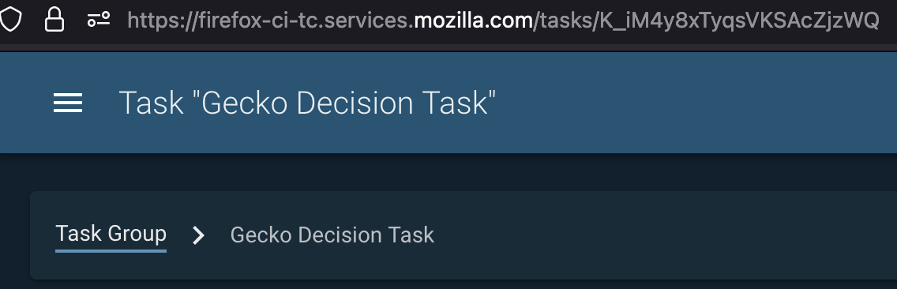

Testing and Customizing Release Promotion actions
=================================================

Actions in Taskgraph allow for adding, cancelling,
retriggering/rerunning tasks in/to the graph. The action docs are
currently
`here <https://firefox-source-docs.mozilla.org/taskcluster/actions.html?highlight=action>`__.

We can test any available action with
``[./mach] taskgraph test-action-callback``, which takes input (schemas
are defined per action), parameters, and taskId/taskGroupId commandline
options. You can run ``[./mach] taskgraph test-action-callback --help``
for more information.

A successful ``[./mach] taskgraph test-action-callback`` run will create
an ``artifacts`` directory in the current working directory (or
``cwd``), which is the base of the repo. This ``artifacts`` directory
will contain the same artifacts that the action task would have created,
had it run in automation. This will generally include information about
tasks it would have scheduled, cancelled, reran or retriggered.

(We use ``./mach taskgraph test-action-callback`` in Gecko, and
``taskgraph test-action-callback`` in standalone taskgraph projects. The
square brackets around ``[./mach]`` indicate that we may or may not need
to include it in the command, depending on which project we’re testing.)

As of this writing (2021.10.06) Gecko actions are all defined in the
`actions
directory <https://searchfox.org/mozilla-central/source/taskcluster/gecko_taskgraph/actions>`__
in-Gecko-tree. Standalone taskgraph actions are either defined `in
taskgraph <https://hg.mozilla.org/ci/taskgraph/file/tip/src/taskgraph/actions>`__
or in each repo (e.g. `Fenix
relpro <https://github.com/mozilla-mobile/fenix/blob/main/taskcluster/fenix_taskgraph/release_promotion.py>`__)

``taskGroupId``\ s
------------------

A decision task with taskId ``decision_task_id`` will, by convention,
have the same taskGroupId, ``decision_task_id``; if you click the
``Task Group`` link at the top left, you’ll find the task group that the
decision task has created.



   Task Group link

An action with a taskId ``action_task_id`` will, also by convention,
have a taskGroupId of the decision task, ``decision_task_id``. And
standard actions, like ``add-new-jobs``, will add additional tasks to
the same ``decision_task_id`` task group. The ``Task Group`` link will
take you to the decision task’s task group.

However, Release Promotion calls the
```taskgraph_decision`` <https://searchfox.org/mozilla-central/rev/a9ef6ad97d2d5f96d5ed51eda38f1a02700ccff7/taskcluster/gecko_taskgraph/actions/release_promotion.py#408>`__
function, which means for a given relpro task with taskId
``relpro_task_id``,

-  the release promotion task itself will have taskId ``relpro_task_id``
   but the taskGroupId of ``decision_task_id``, so the ``Task Group``
   link will take you to the *decision task’s* task group, and
-  the release promotion task will schedule a task group with the
   taskGroupId ``relpro_task_id``. If you are looking at the relpro task
   at
   ``https://firefox-ci-tc.services.mozilla.com/tasks/relpro_task_id``,
   you can replace the ``tasks`` in the url with ``tasks/groups`` to
   view the release promotion task group at
   ``https://firefox-ci-tc.services.mozilla.com/tasks/groups/relpro_task_id``.

Testing Release Promotion actions
---------------------------------

The Release Promotion action exists in multiple repositories (`Gecko,
for
example <https://searchfox.org/mozilla-central/source/taskcluster/gecko_taskgraph/actions/release_promotion.py>`__,
or
`Fenix <https://github.com/mozilla-mobile/fenix/blob/main/taskcluster/fenix_taskgraph/release_promotion.py>`__),
and tends to be customized for each product. Each follows similar
patterns, however. For instance, each follows the `☃
model <https://docs.google.com/presentation/d/1xCQZfLzCto0faO2AHXIsL-Xr-SsL2NnAVqSGbWGEcrg/edit?usp=sharing>`__.
Each consists of various ``flavors``, which tend to involve a ``phase``
(e.g. ``build``, ``promote``, ``push``, and ``ship`` for Gecko
releases), sometimes a ``product`` (``devedition`` vs ``firefox``), and
sometimes a variant, e.g. ``promote_firefox_rc`` or ``push_devedition``.

These are defined in
```taskcluster/ci/config.yml`` <https://searchfox.org/mozilla-central/rev/a9ef6ad97d2d5f96d5ed51eda38f1a02700ccff7/taskcluster/ci/config.yml#210>`__.

Replicating an existing release graph locally
~~~~~~~~~~~~~~~~~~~~~~~~~~~~~~~~~~~~~~~~~~~~~

To run ``[./mach] taskgraph test-action-callback``, we need a
``taskId``, a ``taskGroupId``, a parameters.yml, and an input.yml.

input.yml
^^^^^^^^^

To replicate the input of a previously scheduled task, check the `task
definition <relpro/promote_firefox_NpcI7tFfSDmYVyPNzkYMKw/task.json>`__.
We embed it in ``task.payload.env.ACTION_INPUT``, and in a more useable
format in ``task.extra.action.context.input``.

(There is a `helper
script <relpro/helpers/yaml_input_from_task_json.py>`__ that will open a
``task.json`` in the current directory, and print the input in yaml
format to STDOUT. With that, the input looks like
`this <relpro/promote_firefox_NpcI7tFfSDmYVyPNzkYMKw/input.yml>`__.)

Example promotion test
~~~~~~~~~~~~~~~~~~~~~~

Advanced usage
~~~~~~~~~~~~~~

``rebuild_kinds`` and ``do_not_optimize``
^^^^^^^^^^^^^^^^^^^^^^^^^^^^^^^^^^^^^^^^^

Using multiple revisions
^^^^^^^^^^^^^^^^^^^^^^^^

Using the tested input to craft a custom release graph
^^^^^^^^^^^^^^^^^^^^^^^^^^^^^^^^^^^^^^^^^^^^^^^^^^^^^^
